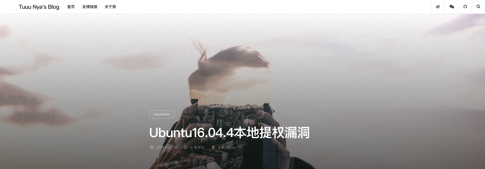
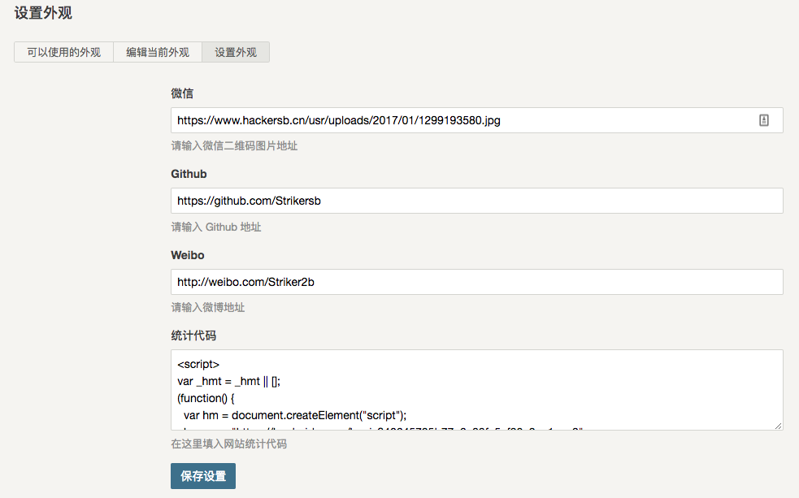

# Typecho-Tuuu

    预览地址：www.hackersb.cn
    
## 友情链接

友情链接插件使用的是[Links](http://www.imhan.com/archives/typecho_links_20141214/)

创建友情链接页面选`自定义模板` -> `友情链接模板`

## 配置页面

一目了然，就不多说了。

## Readme

几年前写的老代码，代码很乱，但是有朋友一直想要，就开源啦！

Author: Tuuu Nya

Blog: www.hackersb.cn
